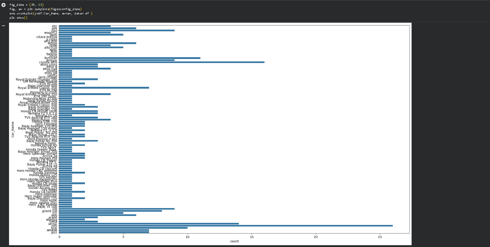
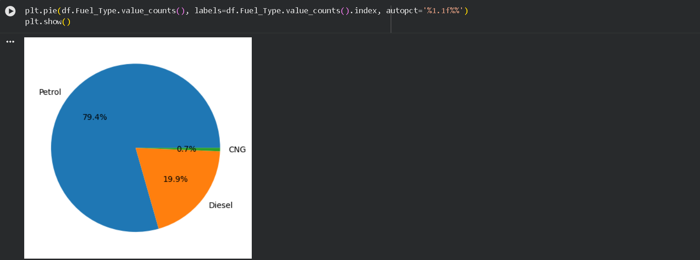
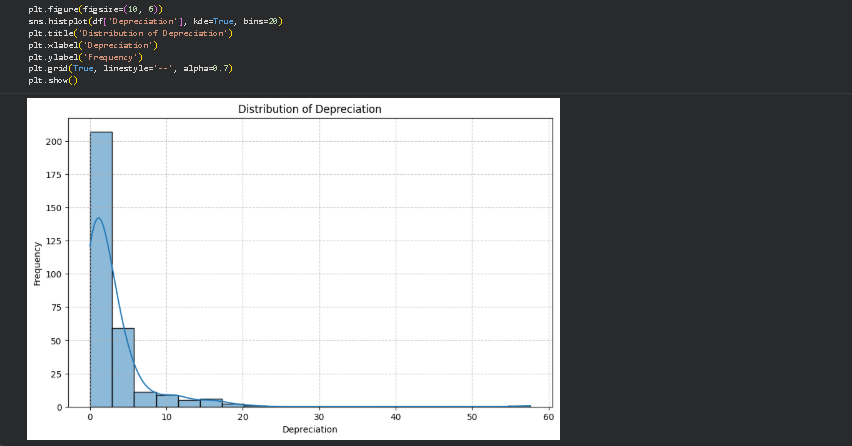
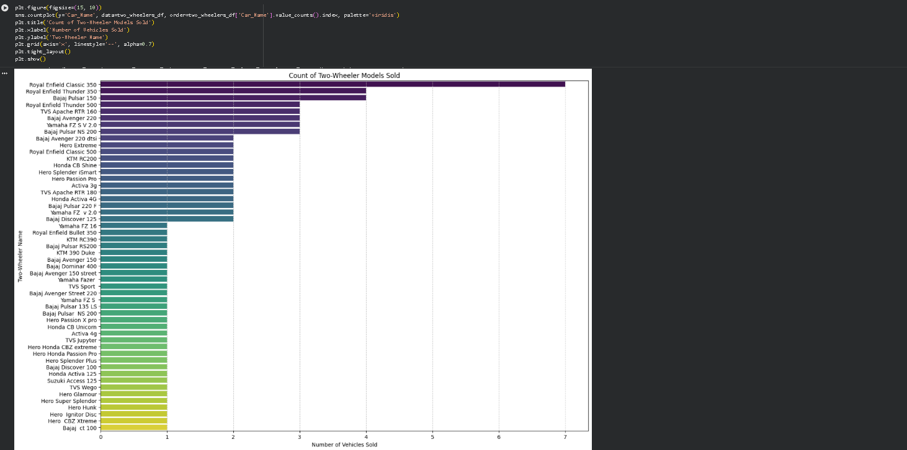

# Car Market Trends Analysis with Car Dekho Data

## Project Overview

This project provides a comprehensive analysis of used car market trends using a dataset from Car Dekho. The primary objective was to extract actionable insights into vehicle characteristics, pricing dynamics, depreciation patterns, and overall market behavior. Through detailed data cleaning, exploratory data analysis (EDA), and specific query resolution, the project aims to answer key questions related to vehicle valuation and market segmentation.

## Dataset

The analysis is based on the `1776311302-P3-Car Market Trends Analysis with Car Dekho Data.csv` dataset, which contains 301 records and 9 features, covering various attributes of used cars and two-wheelers sold in the market.

## Features & Analysis

-   **Data Loading & Cleaning:** Initial data loading using Pandas, followed by checks for data integrity, handling of duplicate records, and verification of null values.
-   **Descriptive Statistics:** Detailed overview of numerical and categorical features to understand data distribution, including min/max years, selling prices, and `Kms_Driven`.
-   **Vehicle Segmentation:** Separation and analysis of data into two-wheelers and cars to provide granular insights for each category.
-   **Depreciation Analysis:** Calculation of a 'Depreciation' metric (`Present_Price - Selling_Price`) to identify the most and least depreciated vehicles, and to understand factors influencing depreciation.
-   **Market Trends Identification:** Analysis of `Fuel_Type`, `Seller_Type`, `Transmission`, and `Owner` to understand their impact on vehicle sales and depreciation.
-   **Oldest & Newest Vehicles:** Identification of the oldest and newest models sold within both car and two-wheeler segments.
-   **Best Deals/Exceeding Expectations:** Highlighted vehicles (both cars and two-wheelers) with minimal depreciation, along with a discussion of potential reasons behind such favorable deals.
-   **Visualizations:** Use of `matplotlib` and `seaborn` for creating various plots (histograms, count plots, pie charts) to visualize data distributions and trends.

## Key Findings

*   **Data Range:** Vehicles span manufacturing years from 2003 to 2018.
*   **Price Range:** Selling prices vary from 0.10 Lakhs to 35.00 Lakhs.
*   **Depreciation Drivers:** `Present_Price`, `Year` (age), `Kms_Driven`, `Fuel_Type`, `Seller_Type`, and `Transmission` are significant factors affecting depreciation.
*   **Top Performers (Low Depreciation):** Specific models like 'TVS Sport', 'Honda Activa 4G', 'Hero Passion X pro', 'Bajaj Avenger 150', and 'Honda Dream Yuga' were identified as having notably low depreciation.
*   **Market Composition:** The dataset includes 98 different vehicle models, with a significant number of petrol vehicles and sales by individual sellers.

## Installation

To run this project locally, you'll need Python and the following libraries. You can install them using pip:

```bash
pip install pandas matplotlib seaborn numpy
```

## Usage

1.  **Clone the repository:**
    ```bash
    git clone https://github.com/Vini269/Data_Analysis_CarDekho
    cd Data_Analysis_CarDekho
    ```
2.  **Download the Dataset:** Place the `1776311302-P3-Car Market Trends Analysis with Car Dekho Data.csv` file into the root directory of the cloned repository.
3.  **Open in Google Colab or Jupyter Notebook:** Launch the provided Jupyter Notebook (`your_notebook_name.ipynb`) in Google Colab or a local Jupyter environment.
4.  **Run all cells:** Execute all cells in the notebook to replicate the analysis and generate the insights and visualizations.

## Screenshots

Here are some of the visualizations and outputs from the analysis:

### Overall Car Name Distribution


_A count plot showing the frequency of different car models in the dataset._

### Fuel Type Distribution


_A pie chart illustrating the proportion of different fuel types (Petrol, Diesel, CNG) in the market._

### Depreciation Distribution


_A histogram showing the distribution of vehicle depreciation values._

### Two-Wheeler Sales Count


_A bar plot displaying the number of units sold for various two-wheeler models._


## Contact

For any questions or further analysis requests, please open an issue in this repository.
